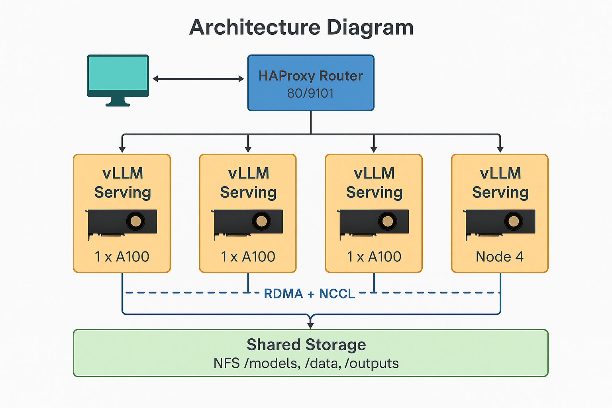
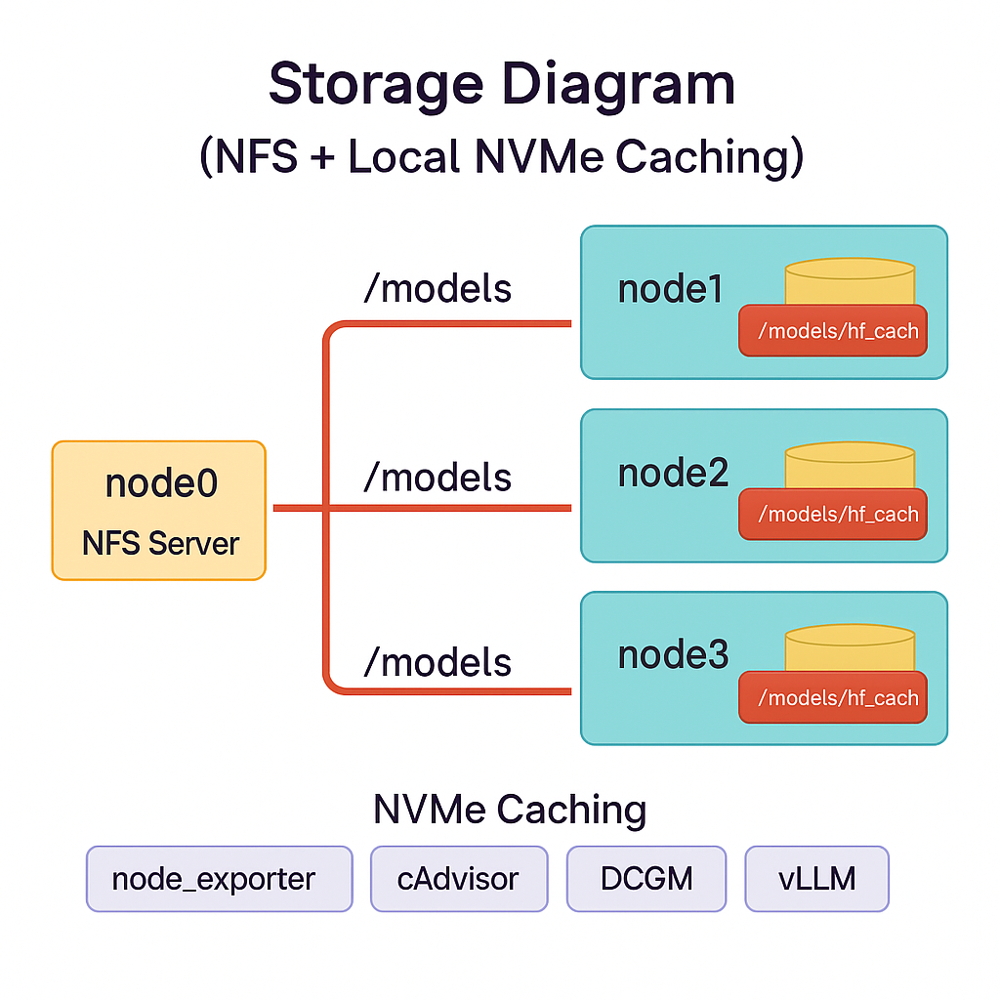
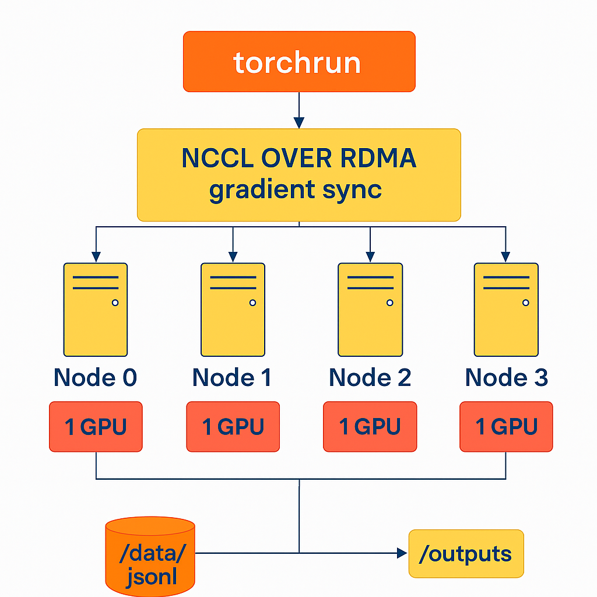
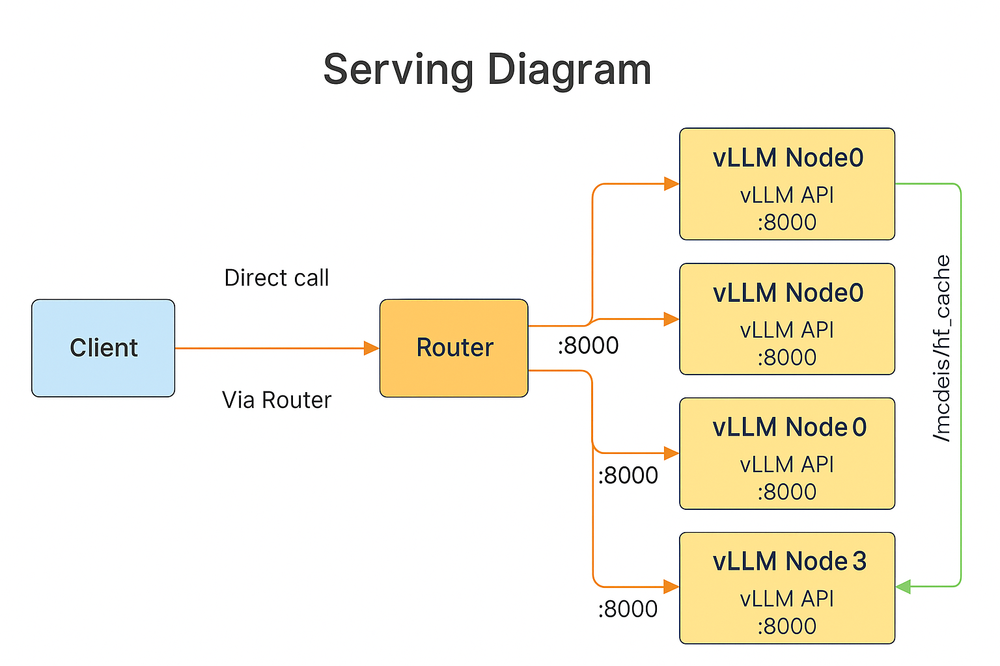
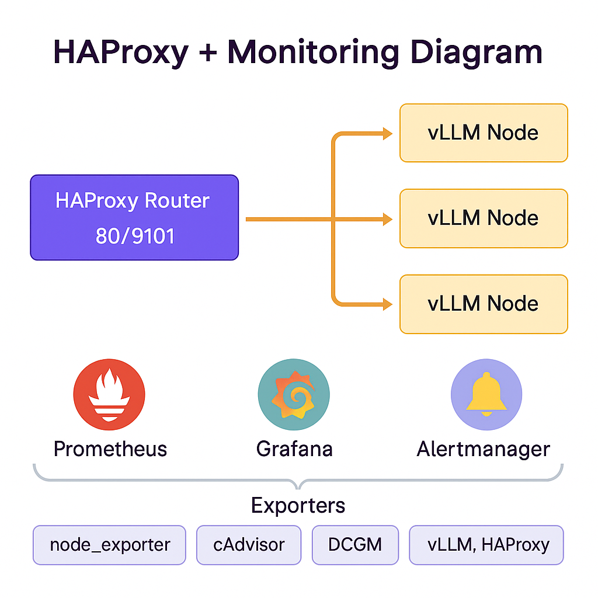

# LLM RDMA + NCCL A100 4-Node Lab



This repository provides a **hands-on portfolio project** that sets up a distributed AI infrastructure using **4 local servers (each with one NVIDIA A100 GPU)**. It demonstrates:
- **Multi-node training** with PyTorch DDP, DeepSpeed, NCCL, and RDMA.
- **Model serving** with vLLM.
- **Traffic load balancing** with HAProxy/NGINX.
- **Monitoring** with Prometheus, Grafana, and NVIDIA DCGM.

The example model used is HuggingFace **Qwen2-7B / Qwen2-7B-Instruct**.

---

## ✨ Features
- **Multi-node Distributed Training** with NCCL + RDMA across 4 servers.
- **Shared Storage (NFS)** for models (`/models`), datasets (`/data`), outputs (`/outputs`) with optional **NVMe caching**.
- **vLLM Serving** on each node; **HAProxy** provides a single endpoint.
- **Observability**: Prometheus + Grafana + Alertmanager; exporters for node, containers, GPUs, HAProxy, and vLLM.

---

## 📂 Repository Structure
```text
llm-rdma-nccl-a100-4n/
├─ README.md
├─ 00-prereq/
├─ 10-nccl-tests/
├─ 20-train-ddp/
├─ 30-serve-vllm/
├─ 40-k8s-optional/
├─ 60-traffic-monitoring/
└─ storage/
```
See each folder's README for details.

---

## 🖥️ Architecture


- **4 nodes** (1× A100 per node)
- RDMA + NCCL for GPU communication
- Shared Storage (NFS: `/models`, `/data`, `/outputs`)
- vLLM Serving + HAProxy Router + Client access

---

## 📦 Storage


- **node0 = NFS server**, **node1~3 = NFS clients**
- Shared HF cache: `/models/hf_cache`
- Optional NVMe caching: copy to `/local_nvme/models/hf_cache` then set `HF_HOME`

---

## 🎓 Training


- Each node: 1 GPU
- `torchrun` → NCCL over RDMA → gradient sync (DeepSpeed ZeRO-2)
- Dataset: `/data/jsonl` | Checkpoints: `/outputs`

---

## ⚙️ Serving


- vLLM API server on each node (`:8000`)
- Client → HAProxy (`:80`) → vLLM nodes
- Model loaded from `/models/hf_cache` (or local NVMe cache)

---

## 📡 Traffic & Monitoring


- **HAProxy Router (80/9101)** → distributes to vLLM nodes
- **Prometheus + Grafana + Alertmanager** for observability
- Exporters: `node_exporter`, `cAdvisor`, `DCGM`, `vLLM`, `HAProxy`

---

## 🚀 Quick Start
1. **NFS Storage**
   ```bash
   ./storage/nfs/server_setup.sh      # On node0
   ./storage/nfs/client_mount.sh 10.0.0.10   # On node0~3
   ```

2. **NCCL Test**
   ```bash
   cd 10-nccl-tests && make build
   bash run_mpi.sh ./hostfile.example
   ```

3. **Training**
   ```bash
   cd 20-train-ddp && docker build -t qwen-train:local .
   export $(grep -v '^#' env.example | xargs); export NODE_RANK=0  # 0/1/2/3 per node
   docker run --rm --net=host --gpus all      -v /models:/models -v /data:/data -v /outputs:/outputs      -e HF_HOME=/models/hf_cache -e TRANSFORMERS_CACHE=/models/hf_cache      -e MODEL_NAME -e DATA_PATH -e OUT_DIR      -e NCCL_SOCKET_IFNAME -e NCCL_IB_HCA -e NCCL_DEBUG      -e MASTER_ADDR -e MASTER_PORT -e NNODES -e NPROC_PER_NODE -e NODE_RANK      qwen-train:local bash -lc "./launch_ds.sh"
   ```

4. **Serving**
   ```bash
   cd 30-serve-vllm && docker build -t qwen-vllm:local .
   export $(grep -v '^#' env.example | xargs)
   docker run --rm --net=host --gpus all      -v /models:/models      -e HF_HOME=/models/hf_cache -e TRANSFORMERS_CACHE=/models/hf_cache      -e MODEL_NAME -e TP_SIZE -e HOST -e PORT -e MAX_MODEL_LEN      qwen-vllm:local bash -lc "./start_vllm.sh"
   ```

5. **HAProxy Router**
   ```bash
   docker run --rm -p 80:80 -p 9101:9101      --add-host node0:10.0.0.10 --add-host node1:10.0.0.11      --add-host node2:10.0.0.12 --add-host node3:10.0.0.13      -v $PWD/60-traffic-monitoring/haproxy/haproxy.cfg:/usr/local/etc/haproxy/haproxy.cfg:ro      haproxy:2.9
   ```

6. **Monitoring**
   ```bash
   cd 60-traffic-monitoring && docker compose up -d
   # Grafana: http://<router>:3000 (admin/admin)
   ```

---

## 📊 Metrics & Alerts
- GPU: DCGM exporter (util, mem, power, ECC)
- Node: node_exporter
- Containers: cAdvisor
- Serving: vLLM `/metrics`
- Traffic: HAProxy exporter (`:9101/metrics`)
- Alerts: GPU util > 95% (3m), vLLM p95 > 1.5s, disk < 10%

---

## Author
**Eunki7**  
- GitHub: [https://github.com/eunki-7](https://github.com/eunki-7)

---

## 📜 License
- Models: Qwen2-7B / Qwen2-7B-Instruct (HuggingFace license)
- Frameworks: NCCL, DeepSpeed, vLLM, Prometheus, Grafana, DCGM
- License: MIT
